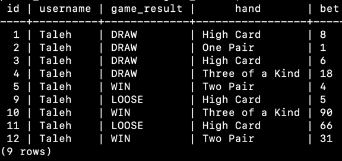

# poker app

# How To?
### In terminal, run:
- `docker-compose up`

This will run `docker-compose.yaml` and `init.sql` files to create both a postgresql database `poker_db` and a table `game_result`

### In another terminal run in order:
- `sbt`
- `~run`

Then select `[2]main`. So the application is ready and connected to database.

### Run Tests:
- `sbt test`

### To check DATABASE, follow these steps in a new Terminal
- List all containers: `docker container ps`

- Enter to the newly created container: `docker exec -it poker_postgresql_1 psql -U postgres -d postgres`

- Enter password: `123456`

- List Databases: `\l`

- Connect to our Database: `\c poker_db`

- Query:`SELECT * FROM game_result;`

Result:

# Things to Refactor
- Docker is used to create the table. Better to use a database migration tool like `Flyway`.
- Database configuration injected directly to the codebase. Better to define them in `application.conf`.
- Should have better package structure.
- In the poker game, user can have duplicate cards. Should be checked if a card is already added.